# sovvf

=======
# Sala Operativa 115

## Introduzione

Di seguito sono elencate alcune delle funzionalità della nuova applicazione per la gestione del soccorso dei Vigili del Fuoco.

### Dashboard

Screenshot della dashboard del nuovo applicativo SO115 web.

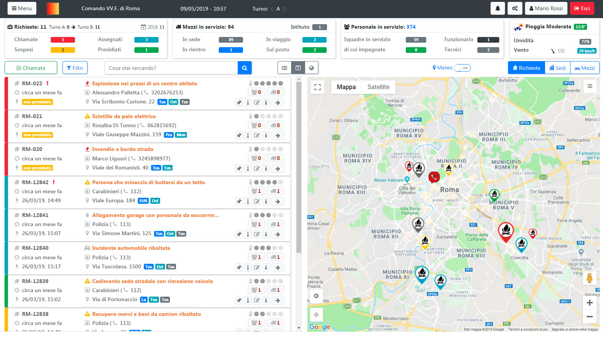

### Feature Boxes (informazioni aggregate)

Screenshot della parte superiore della dashboard, dove sono visualizzate le informazioni aggregate della dashboard.

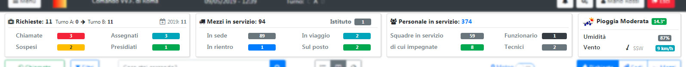

### Feature Dettaglio Intervento

Screenshot del dettaglio di un intervento.

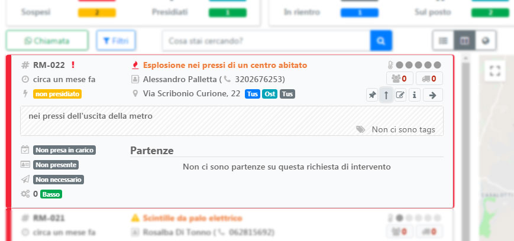

### Feature Dettaglio Intervento in Mappa

Screenshot del dettaglio di un intervento cliccato dalla mappa.

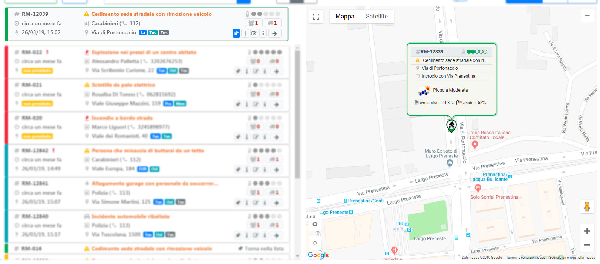

### Feature Chiamata

Screenshot della form inserimento di un nuovo intervento.

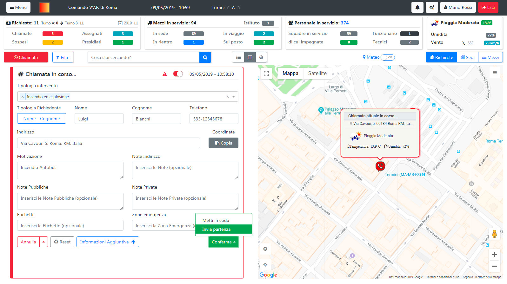

### Feature Composizione Partenza Avanzata

Screenshot della Composizione Partenza Avanzata.

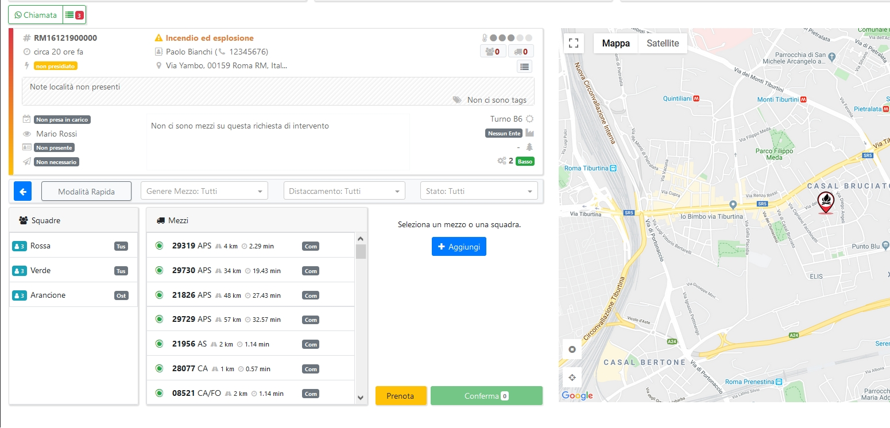

### Feature Composizione Partenza Rapida

Screenshot della Composizione Partenza Rapida.

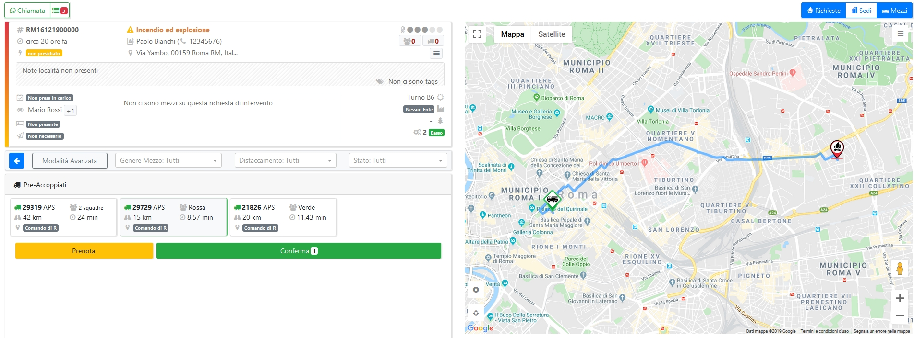

### Feature Mappa

Screenshot visualizzazione Mezzi, Interventi e Sedi sulla mappa.

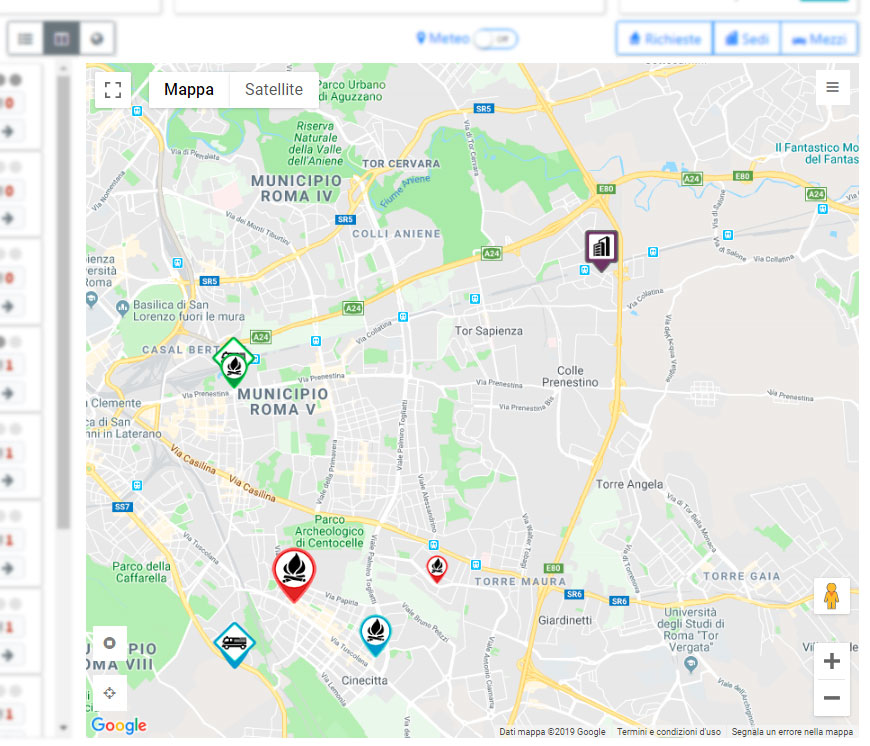

### Feature Mappa Meteo

Screenshot visualizzazione condizioni Meteo.

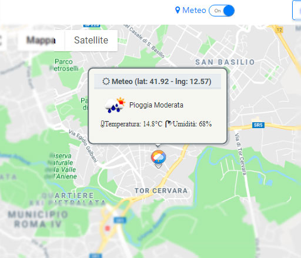

### Dashboard solo Mappa

Screenshot della dashboard in modalità __solo Mappa__.

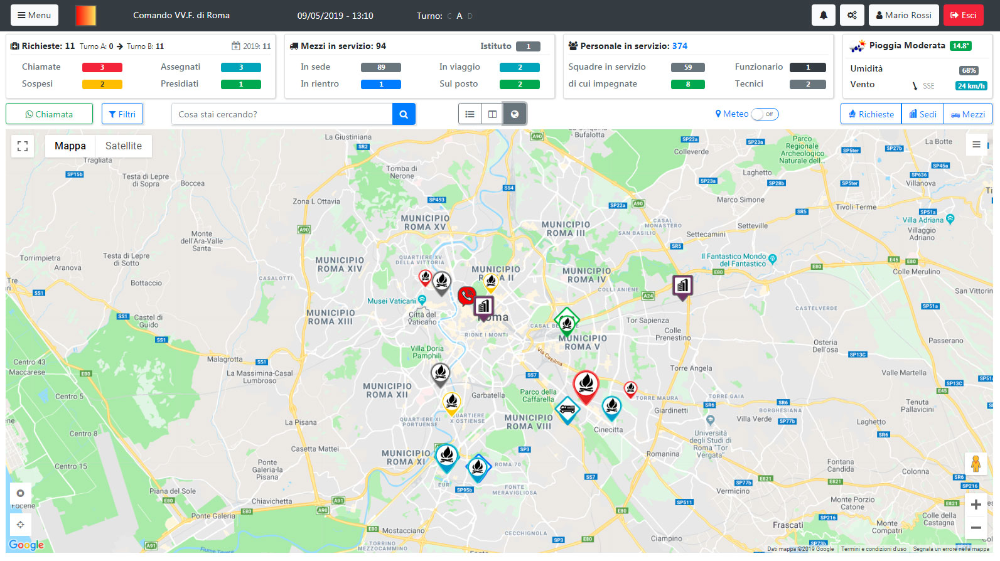

### Feature Lista Schede Contatto NUE

Screenshot della visualizzazione delle schede contatto Nue

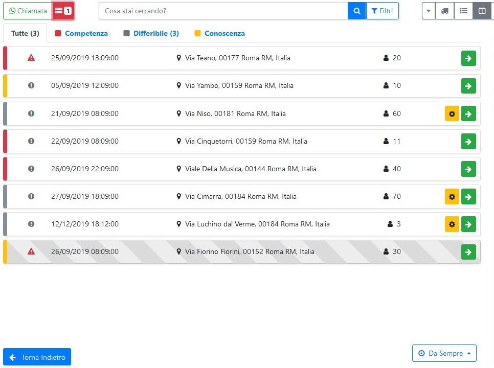

### Feature Scheda Contatto dettaglio

Screeenshot della visualizzazione del dettaglio di una Scheda Contatto

### Feature Lista Mezzi In Servizio

Screenshot della visualizzazione dei mezzi in servizio sia in una lista che sulla mappa

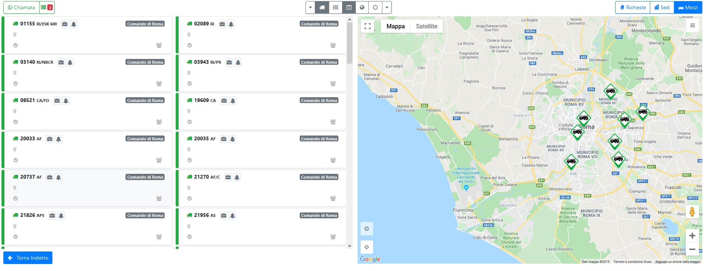

## Il backend

Il backend di SOVVF è un backend RESTful implementato in .NET Core, cluster enabled e conforme ai paradigmi SOLID e CQRS. Ogni azione svolta dal backend attraversa una catena di fasi successive, rappresentate nel seguente schema.

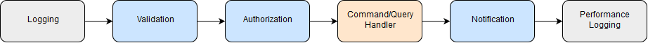

La fase di log registra la natura dell'azione svolta, l'utente che la svolge, l'istante di esecuzione e i dati di ingresso che alimentano l'azione, anche a fini di auditing sul sistema. La fase di validazione verifica che i dati di ingresso siano validi e sicuri. La fase di autorizzazione verifica che l'utente abbia i permessi per eseguire l'azione. La fase di notifica ha il compito di notificare l'avvenuta azione ai sottomoduli del sistema ed ai sistemi esterni integrati con SOVVF. Infine la fase di log di performance, registra i tempi di esecuzione dell'azione ai fini di analisi delle prestazioni e profilazione del sistema.
