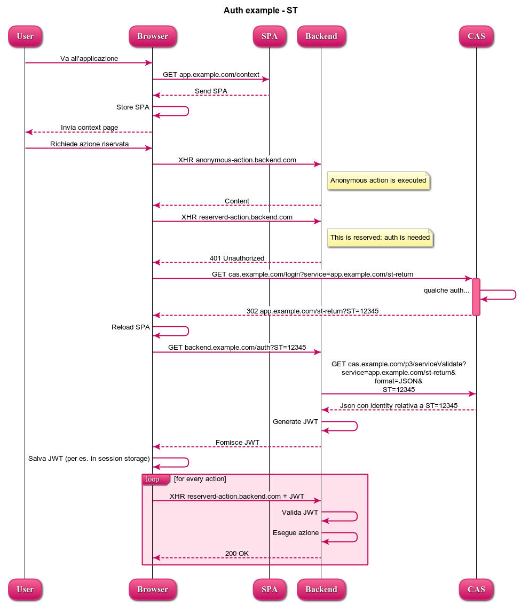

# Auth model



<<<<<<< HEAD:doc/auth model/README.md
Il diagramma di sopra può essere renderizzato copiando il listato di sotto all'indirizzo [https://www.websequencediagrams.com/](https://www.websequencediagrams.com/).
=======
Il diagramma di sopra può essere renderizzato copiando il listato di sotto all'indirizzo [// https://www.websequencediagrams.com/](// https://www.websequencediagrams.com/).
>>>>>>> 30c6b27fc83c45849a548e2aaf739a769907699a:doc/auth model/README.md

```
// https://www.websequencediagrams.com/

title Auth example - ST

User->Browser: Va all'applicazione
Browser->SPA: GET app.example.com/context
SPA-->Browser: Send SPA
Browser->Browser: Store SPA
Browser-->User: Invia context page
User->Browser: Richiede azione riservata

Browser->Backend: XHR anonymous-action.backend.com
note right of Backend
Anonymous action is executed
end note
Backend-->Browser: Content

Browser->Backend: XHR reserverd-action.backend.com
note right of Backend
This is reserved: auth is needed
end note
Backend-->Browser: 401 Unauthorized
Browser->+CAS: GET cas.example.com/login?\nservice=app.example.com/st-return
CAS->CAS: qualche auth...
CAS-->-Browser: 302 app.example.com/st-return?ST=12345
Browser->Browser: Reload SPA
Browser->Backend: GET backend.example.com/auth?\nservice=app.example.com/st-return&\nST=12345
Backend->CAS: GET cas.example.com/p3/serviceValidate?\nservice=app.example.com/st-return&\nformat=JSON&\nST=12345
CAS-->Backend: Json con identity relativa a ST=12345
Backend->Backend: Generate JWT
Backend-->Browser: Fornisce JWT
Browser->Browser: Salva JWT (per es. in session storage)
loop for every action
Browser->Backend: XHR reserverd-action.backend.com + JWT
Backend->Backend: Valida JWT
Backend->Backend: Esegue azione
Backend-->Browser: 200 OK
end
```