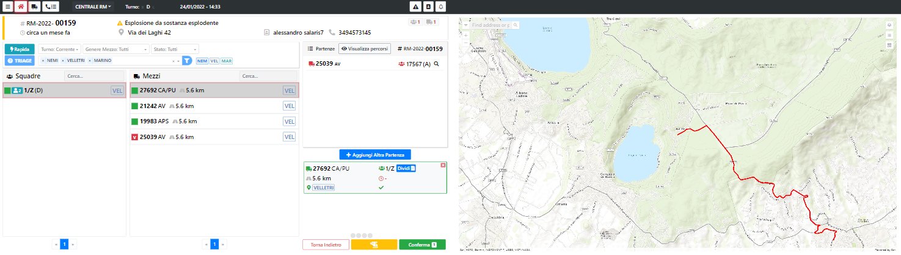
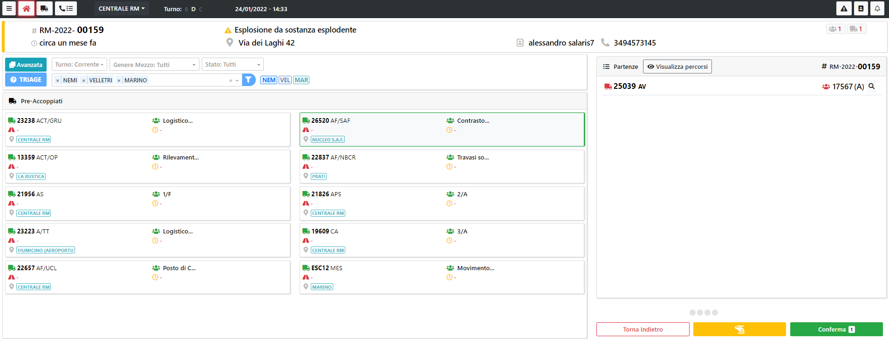

# Composizione Partenza

In Composizione Partenza è possibile assegnare una o più partenze sull'intervento.

La schermata è composta dal riassunto dell'intervento, dalla lista delle squadre disponibili, dalla lista dei mezzi disponibili e dal riassunto delle partenze già presenti sull'intervento.

> 

<b>Lista Squadre</b>
In automatico il sistema filtra le squadre delle tre competenze che sono state assegnate all'intervento.
Questa selezione non è bloccante, se un operatore ha la necessità di selezionare squadre di altre competenze può scegliere se togliere i filtri delle competenze o aggiungere nei filtri le competenze desiderate.

<b>Lista Mezzi</b>
L'ordine che viene presentato in automatico segue le seguenti regole:
- Vengono presentati i mezzi delle tre competenze dell'intervento
- L'ordine dei mezzi è per tipologia mezzo opportuno in base all'emergenza, distanza dall'intervento, minuti di percorrenza

Selezionando una squadra e un mezzo si forma automaticamente la partenza corrispondente. 
A questo punto si può o aggiungere un'altra partenza premendo sul tasto  oppure premere su  per confermare la partenza.

> Se si ritiene opportuno far intervenire il soccorso aereo, si dovrà premere il tasto . Da li si potrà selezionare la tipolgia di intervento e inserire una descrizione dello stesso. 

> Qualora ci fosse un Triage sull'intervento, il tasto  permetterà di consultarne il risultato.

> E' anche possibile effettuare delle partenze utilizzando dei preaccoppiati. Per accedere alla funzionalità basta premere il tasto  e la schemata che si presenta è la seguente

> Premendo il tasto  è possibile visualizzare sulla mappa il percorso di tutti i mezzi che stanno intervenendo sull'intervento.

> <b>N.B. Selezionando un mezzo, sulla mappa, viene visualizzato il percorso migliore per la tipolgia di mezzo, fino all'obiettivo.</b>
