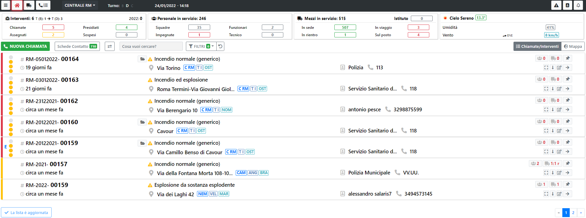
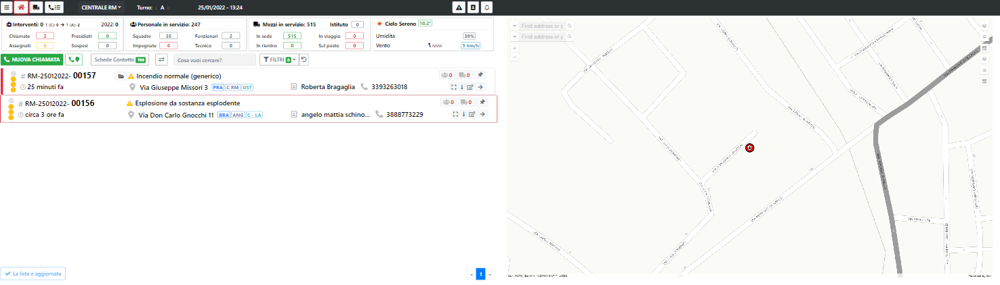

# Home Page

Questa è la pagina principale dell'applicazione, da qui è possibile gestire tutto il soccorso, dalla creazione di una Chiamata,
alla composizione di una partenza, dalla gestione delle partenze alla chiusura dell'intervento. 

Per accedere alla pagina si passa dal menu laterale e si clicca sull'apposito tasto:

Se si hanno 2 monitor con schermo espanso oppure uno schermo WideScreen la visualizzazione cambierà automaticamente adattandosi ai pixel a disposizione.
La HomePage quindi si vedrà in questo modo. Sulla destra si vedrà l'area della sede di riferimento e se si seleziona una richiesta la mappa zooma automaticamente
sull'intervento, inoltre se si hanno dei mezzi che si stanno portando sull'intervento si vedranno sulla mappa.

---

> ATTENZIONE
>
> Per poter creare una chiamata è necessario il ruolo di "Gestore Chiamate", per poter accedere alla funzionalità di Composizione Partenza è necessario 
> il ruolo di "Gestore Richiesta".
