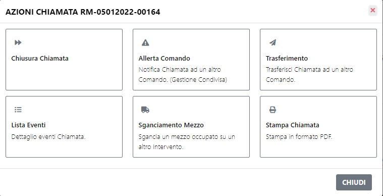
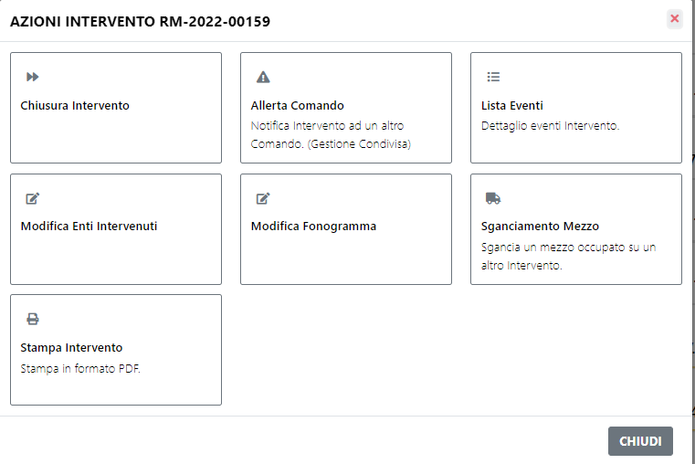

# Azioni

Premendo il tasto quadrato presente a destra di ogni intervento si apre una modale con le azioni possibili.

<b>Azioni Chiamata</b>

Se si seleziona una <b>chiamata</b> le azioni possibili saranno:
- Chiudere la chiamata
- Allertare un altro comando: Consente al comando allertato di poter inviare partenze sull'intervento, oltre alle partenze della sede principale
- Trasferimento: Consente il trasferimento della chiamata ad altro comando, a differenza dell'allerta, la gestione dell'intervento passa interamente al comando di destinazione
- Lista Eventi: Presenta l'elenco di tutti gli eventi che sono stati generati sull'intervento selezionato, in più presenta una sezione chiamata "LogBook" dove l'operatore può inserire dei propri appunti
- Sganciamento Mezzo: Da qui è possibile sganciare un mezzo da un altro intervento e farlo interventire sull'intervento selezionato
- Stampa Chiamata: Consente di stampare il dettaglio della chiamata

<b>Azioni Intervento</b>

Se si seleziona un <b>intervento</b> le azioni possibili sono simili a quelle di una chiamata, ma non sarà possibile trasferire l'intervento ad altro comando.
In più è possibile:
- Aggiungere un ente intervenuto sull'intervento
- Aggiungere un fonogramma

