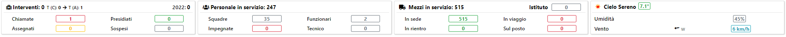

# Box

Al di sotto della NavBar ci sono 4 Box che riepilogano la situazione attuale della sede selezionata.
I quattro box rappresentano: 
- La situazione degli <b>interventi</b>, divisi per: Chiamate, Assegnati, Presidiati, Sospesi
- La situazione del <b>personale</b>, diviso per: Squadre, Funzionari, Impiegate, Tecnico
- La situazione dei <b>mezzi</b>, divisi per: In sede, In viaggio, Sul Posto, In rientro
- Il meteo