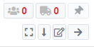
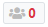
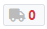
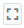
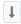
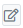
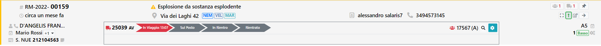

# Elenco Interventi

Sulla Home Page è presente l'elenco di tutte le chiamate e tutti gli interventi che si stanno svolgendo nella sede selezionata.
La lista non ha un ordine casuale, ma presenta per prime le chiamate e a seguire gli interventi. Il loro stato è definito dal colore dell'intervento

Per ogni Chiamata/Intervento sono presenti dei tasti funzione sulla destra.

Questi Tasti indicano:
-  Il numero di squadre impegnate sull'intervento, se si preme sul numero è possibile vedere le squadre impegnate
-  Il numero di mezzi impegnati sull'interventi, se si preme sul numero è possible vedere i mezzi impegnati
-  Il tasto per bloccare in alto l'intervento. Questo tasto è utile per bloccare la richiesta che si sta gestendo sempre all'inizio della lista. 
-  Il tasto quadrato: Questo tasto apre la maschera delle azioni possibili sull'intervento.
-  Il tasto freccia in basso: Apre il dettaglio della chiamata/intervento
-  Il tasto modifica: Consente di modificare le informazioni dell'intervento
-  Il tasto freccia a destra: Apre la Composizione Partenza

<b>Dettaglio Intervento</b>
Tramite il tasto "freccia in basso" è possibile aprire il dettaglio dell'intervento. Da questo dettaglio è possibile gestire le eventuali partenze presenti. 
E' possibile cambiare lo stato di una partenza, premendo sullo stato desiderato e indicando la data e l'ora nella quale, la partenza, ha assunto lo stato selezionato. 
E' anche possibile vedere i componenti di una squadra tramite il tasto lente a destra delle squadre.

