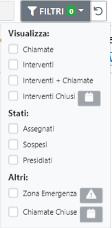

# Filtri

Al di sotto dei Box riepilogo sono presenti i filtri che interagiscono con la lista delle Chiamate/Interventi

Tramite la ricerca testuale è possibile ricercare un qualsiasi testo all'interno di tutte le richieste. Dal nome del richiedente, alla targa di un mezzo, al nome di una squadra

Tramite i filtri invece è possibile:
- Visualizzare solo le Chiamate
- Visualizzare solo gli Interventi
- Visualizzare sia Chiamate che Interventi
- Visualizzare gli interventi Chiusi indicando un lasso di tempo
- Visualizzare gli interventi che hanno un determinato stato: Assegnato, Sospeso o Presidiato
- Visualizzare le Chiamate Chiuse
