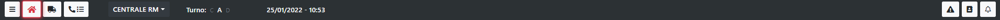

# Navbar

Dalla barra di navigazione è possibile spostarsi tra le diverse funzionalità dell'applicazione, in più è possibile spostarsi tra i diversi comandi, direzioni regionali e visualizzare le informazioni del CON. 

Partendo da sinistra, le icone indicano:
- <b>Icona Toast (Le tre righe orizzontali)</b>: Aprono il menù laterale dal quale è possibile accedere alle funzioni di settings dell'applicazione
- <b>Icona Home</b>: Consente di tornare all'Home Page
- <b>Icona APS</b>: Consente di accedere alla funzionalità "Mezzi in servizio", dove si trova il riepilogo di tutti i mezzi in servizio nella sede selezionata e il loro stato
- <b>Icona Cornetta</b>: Consente di accedere alla funzionalità "Coda Chiamate", dove si trova il riepilogo di tutte le sedi al disotto dei quella selezionata 
- <b>Sede Selezionata</b>: Indica la sede selezionata, premendo sul tasto è possibile spostarsi in altre sedi o selezionarne più di una
- <b>Turno Corrente</b>: Indica il turno corrente
- <b>Data e ora</b>: Indicano la data e l'ora correnti
- <b>Icona Triangolo</b>: Consente di accedere alla funzionalità "Gestione Emergenza", dalla quale è possibile creare e gestire un emergenza
- <b>Icona Rubrica</b>: Consente di accedere alla funzionalità "Rubrica"
- <b>Icona Campanella</b>: Segnala se per la sede selezionata ci sono segnalazioni particolari (Es. Un emergenza creata)

