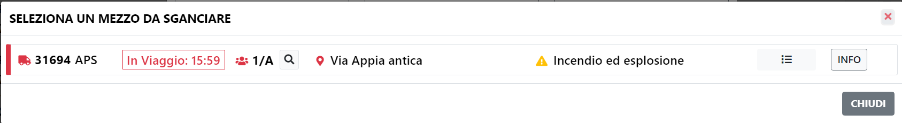
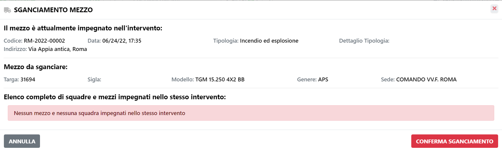
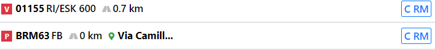

# Sganciamento

Qualora servisse un mezzo già impiegato su un altro intervento, è possible effettuare lo sganciamento.

Lo sganciamento è possibile farlo da 2 punti differenti:

<b>Pannello AZIONI</b>

Dal pannello delle azioni presenti sulla Home Page in ogni intervento  selezionando il tasto apposito . 

Una volta premuto il tasto si presenterà la modale con tutte le azioni possibili sull'intervento 

Premendo sul tasto "Sganciamento Mezzo" si visualizzerà la lista di tutti i mezzi che risultano occupati.

Premendo il tasto "INFO" presente sulla destra di ogni mezzo, verrà visualizzato il dettaglio dello sganciamento che si sta effetuando, a questo punto, se si ritiene opportuno, si preme il tasto "Conferma Sganciamento" e verrà creata una partenza nell'intervento sul quale si effettua l'azione e verrà chiusa la partenza nell'intervento precedente.

<b>Composizione Partenza</b>

Un altro funzionalità dal quale è possibile effettuare lo sganciamento è la composizione partenza. 

Nella lista dei mezzi sono evidenziati i mezzi occupati, tramite un'icona apposta sulla sinistra di ogni mezzo. 

Premendo su un mezzo occupato si potrà eseguire lo Sganciamento di quest'ultimo, confermandolo tramite il tasto "Conferma Sganciamento" nella finestra di dettaglio visualizzata

> N.B. Se sull'intervento dal quale si sta togliendo la partenza era presente solo una partenza, l'intervento assumerà lo stato di sospeso
