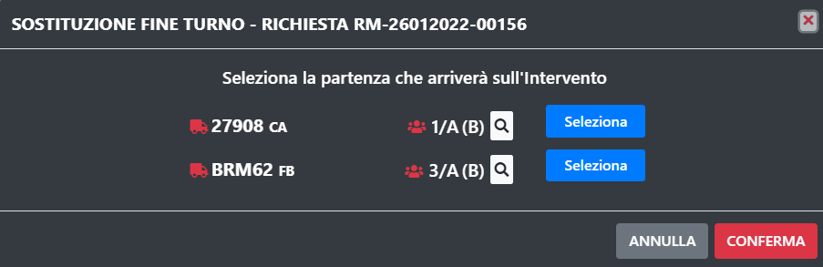
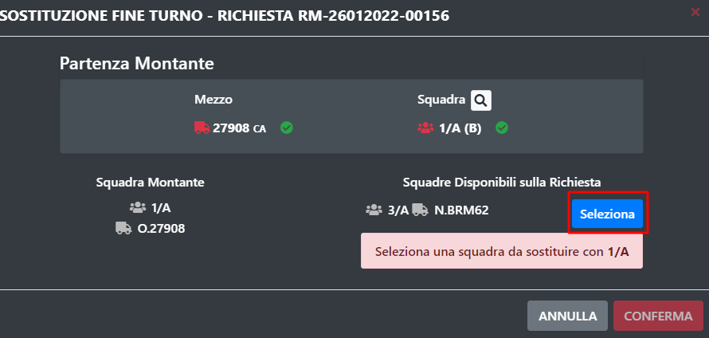
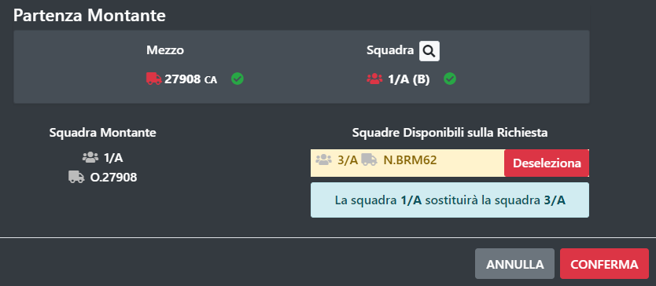

# Sostituzione

SO115Web consente di effettuare la sostituzione tra due squadre sullo stesso mezzo. 
Per fare questa azione è necessario che due partenze, quella dal quale togliere la squadra e quella dal quale prendere quella nuova, si trovino sul posto dell'intervento.

In questa situazione comparirà una nuova icona in alto a sinistra della sezione delle partenze

Premendo questo tasto si aprira la procedura di sistituzione, la prima cosa da fare è selezionare il mezzo che contiene la squadra subentrante.

Il passo successivo è selezionare la squadra smontante.

L'ultimo passaggio è la conferma della sostituzione

> N.B. Una volta confermata la sostituzione, la partenza contentene la squadra smontante, verrà messa in rientro.