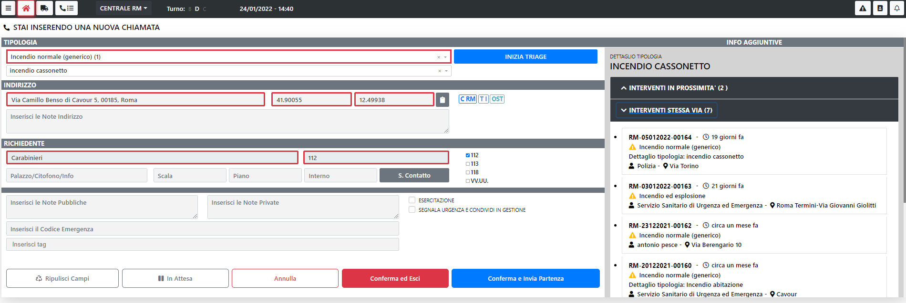

# Nuova Chiamata

Premendo sul tasto verde "Nuova Chiamata" presente in Home Page è possibile inserire una nuova chiamata.

Il form presenta i seguenti campi:
- Tipologia Intervento: Campo Obbligatorio
- Dettaglio Tipologia: Se presente è possibile selezionare un dettaglio per la tipologia selezionata
- Indirizzo intervento: Campo Obbligatorio
- Coordinate: E' un campo che viene riempito automaticamente quando si inserisce l'indirizzo, ma è comunque modificabile
- Note indirizzo: Campo libero
- Nominativo richiedente: Campo obbligatorio
- Telefono: Campo obbligatorio 
- Palazzo/Scala/Interno/Citofono: campi non obbligatori
- Note Pubbliche: campo non obbligatoro
- Note Private: campo non obbligatoro
- Esercitazione: Indica se la chiamata che si sta registrando è per un'esercitazione
- Codice Emergenza: campo non obbligatoro
- Tag: Questa sezione è utile per la ricerca testuale presente in Home Page

> <b> N.B. Le coordinate definiscono le competenze. </b>

> <b> N.B. Una volta inserito l'indirizzo, sulla destra, vengono presentate 2 sezioni: Interventi nelle vicinanze e Interventi sulla stessa via</b>

> <b> N.B. Quando si seleziona un dettaglio tipologia, se presente, viene visualizzata la POS associata</b>

> <b> N.B. Quando si seleziona un dettaglio tipologia, se presente, si abilita il tasto del TRIAGE</b>

Una volta riempiti tutti i campi desiderati è possibile fare una delle seguenti azioni:
- <b>"Ripulisci Campi"</b>: Azzera la form ripulendo tutti i campi precedentemente riempiti
- <b>"In Attesa"</b>: Salva la chiamata ma rimane sulla form
- <b>"Annulla"</b>: Permette di annullare l'inserimento della chiamata
- <b>"Conferma ed esci"</b>: Permette di salvare la chiamata e tornare alla Home Page
- <b>"Conferma ed invio partenza"</b>: Permette di salvare la chiamata ed andare direttamente alla composizione partenza