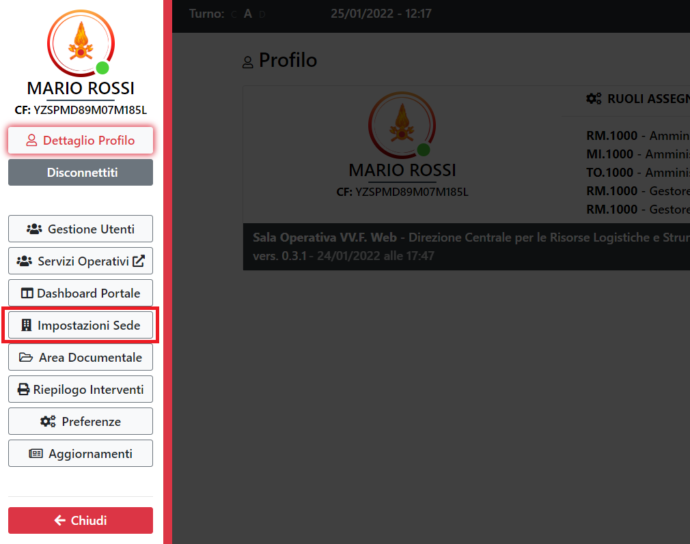

# Impostazioni Sede

Impostazioni relative alla sede.

Per accedere alla pagina si passa dal menu laterale e si clicca sull'apposito tasto:

---

> ATTENZIONE
>
> Per accedere alla pagina e visualizzare le impostazioni della sede, è necessario il ruolo di amministratore.
