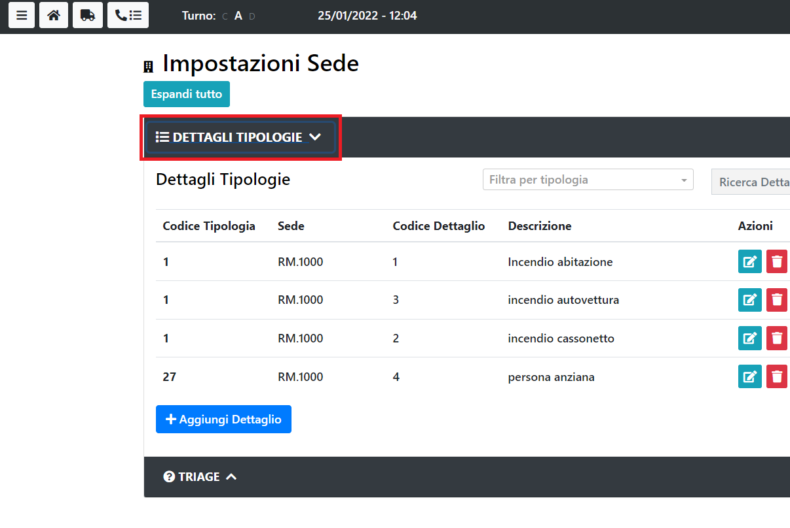

# Dettagli Tipologie

Impostazioni relative alla sede.

Per visualizzare la sezione dedicata ai Dettagli Tipologie si clicca sull'apposito tasto:

---

> ATTENZIONE
>
> Per accedere alla sezione dei Dettagli Tipologie, è necessario il ruolo di amministratore.
