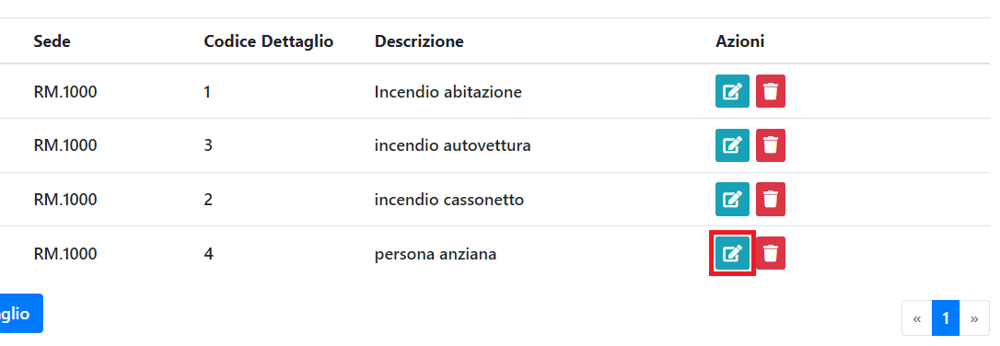
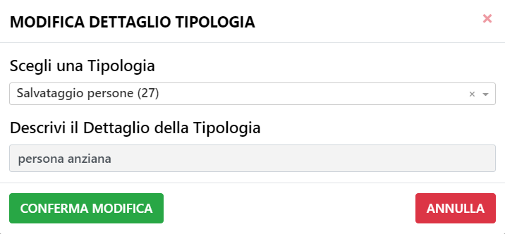

# Nuovo Dettaglio Tipologia

E' possibile modificare un Dettaglio Tipologia tramite l'apposito tasto.

Si aprirà il seguente pannello.

Tra i dati che è possibile modificare troviamo la Tipologia al quale è associato e il nome del Dettaglio Tipologia.
