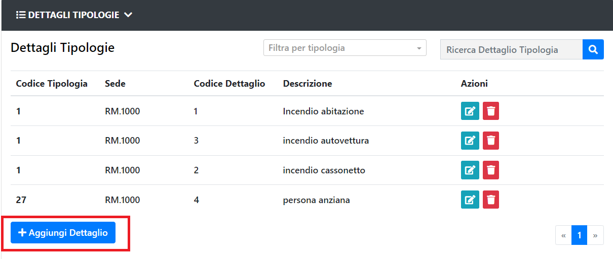
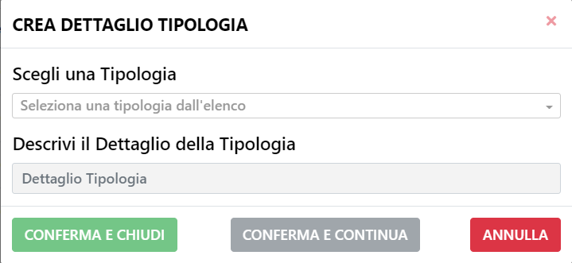

# Nuovo Dettaglio Tipologia

E' possibile creare un nuovo Dettaglio Tipologia tramite l'apposito tasto.

Si aprirà in seguito il pannello con i dati da inserire del nuovo Dettaglio Tipologia.

Tra i dati da inserire, vanno specificati la tipologia al quale associarlo e il nome che gli si vuole assegnare.
