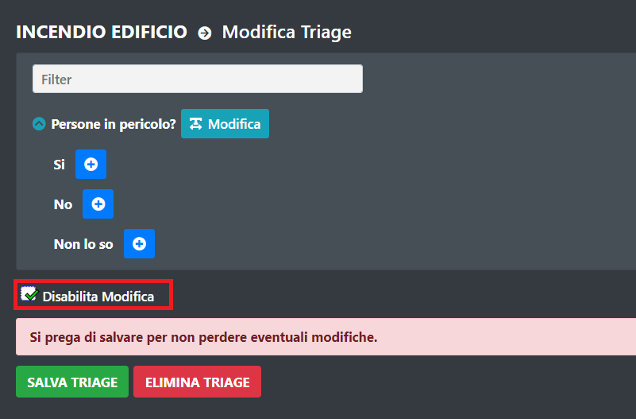
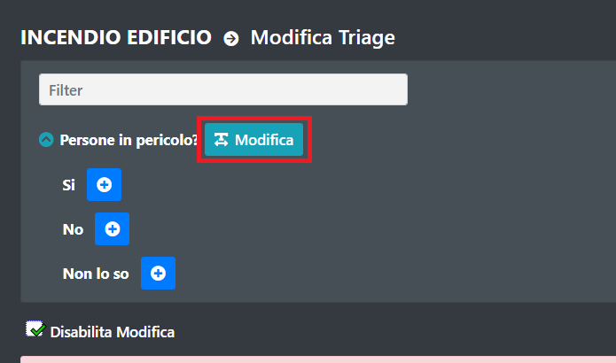
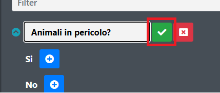
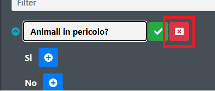
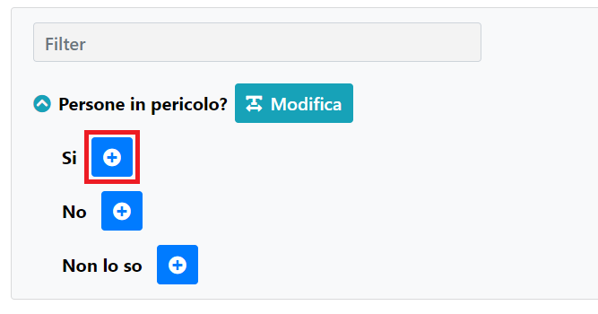
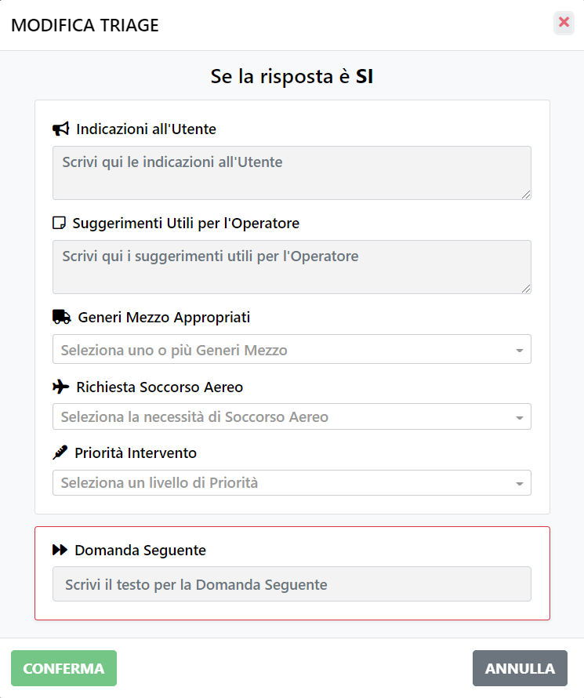
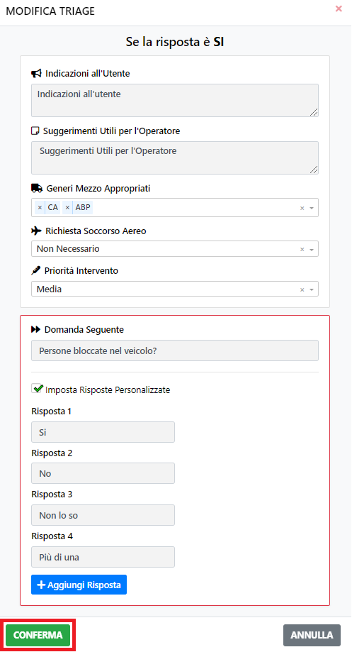
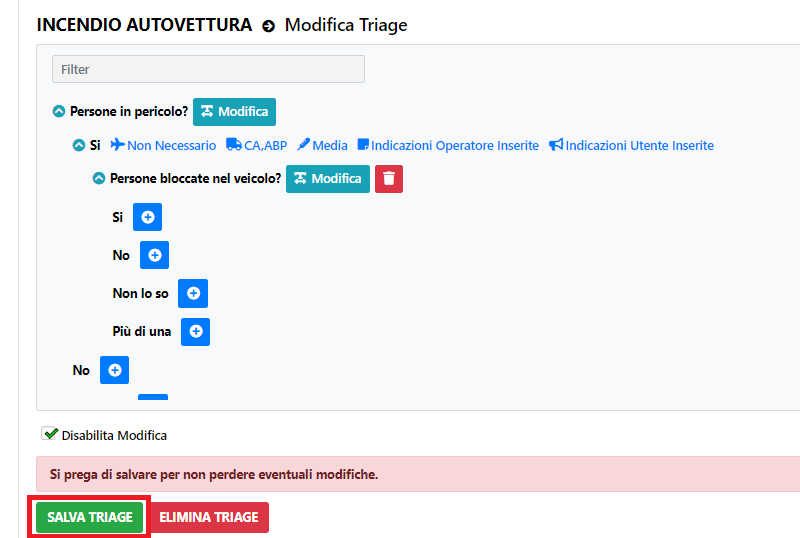

# Modifica Triage

Per modificare un Triage selezionare "Abilita Modifica".

Questo abiliterà la modalità di modifica del Triage.

Per modificare il testo di una domanda bisogna premere il pulsante "Modifica" di fianco alla domanda che vogliamo modificare.

Per confermare la modifica selezionare il pulsante dedicato.

Altrimenti per annullare la modifica selezionare il seguente pulsante.

Altrimenti per annullare la modifica selezionare il seguente pulsante.

Per aggiungere una domanda consecutiva ad una risposta premere sul pulsante di fianco alla risposta scelta.

A questo punto apparirà una finestra nel quale possiamo inserire la domanda seguente alla risposta scelta ed altre informazioni.

Una volta inserite le informazioni premere sul pulsante di conferma.

A questo punto ci verrà mostrato il risultato e sarà necessario salvare tramite l'apposito pulsante.

