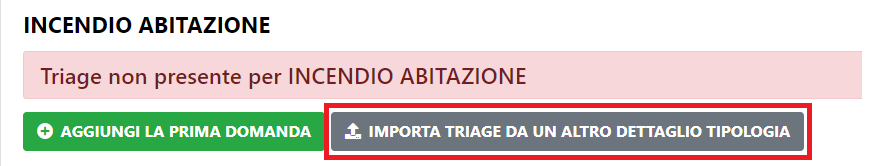
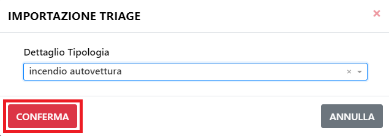
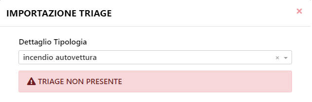

# Importazione Triage

Per importare un Triage premere il pulsante "Importa Triage da un altro Dettaglio Tipologia".

A questo punto selezionare il Dettaglio Tipologia da cui importare il triage e premere "Conferma".

Se il Dettaglio Tipologia da cui si vuole importare il Triage ne ha uno disponibile, verrà importato e salvato automaticamente.

Altrimenti verrà mostrato un errore.

