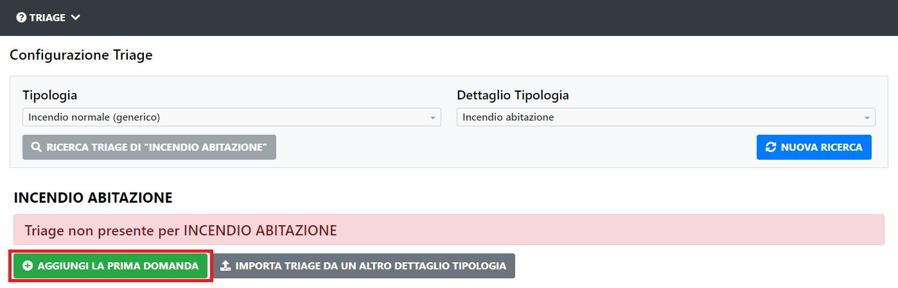
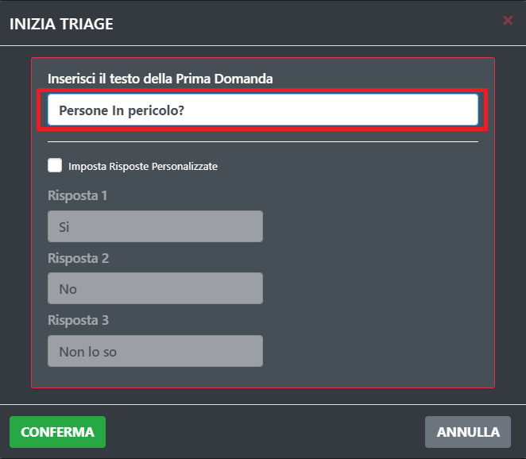
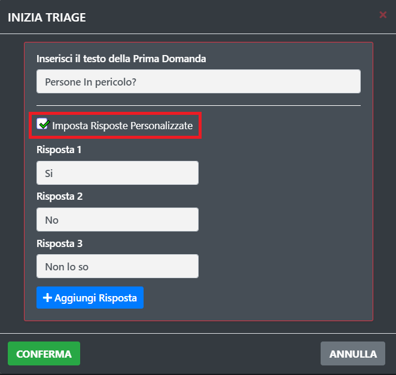
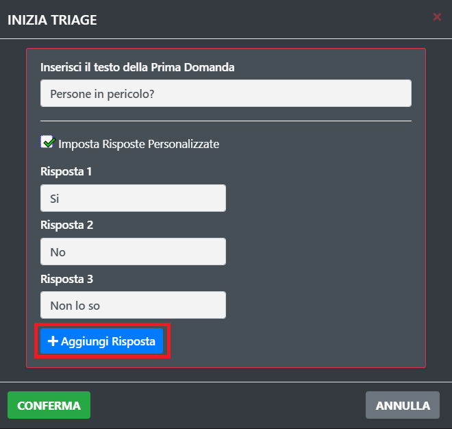
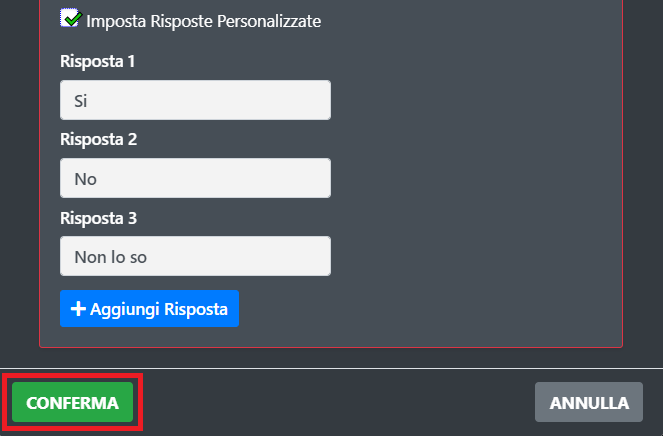
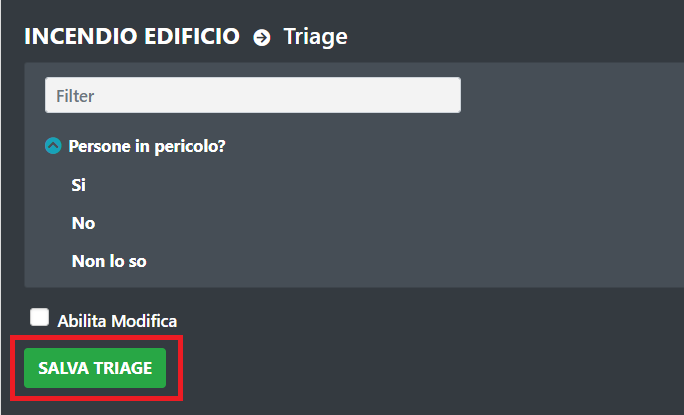

# Creazione Triage

Per creare un Triage premere il pulsante "Prima Domanda".

A questo punto scrivere il testo della domanda che si vuole aggiungere.

Se si vogliono personalizzare le risposte selezionare la voce "Risposte Personalizzate".

A questo punto possiamo personalizzare le risposto e/o aggiungerne delle altre tramite l'apposito pulsante.

Una volta inseriti i dati che si vogliono basterà premere il pulsante di conferma.

Salviamo i dati inseriti tramite l'apposito pulsante di salvataggio.

