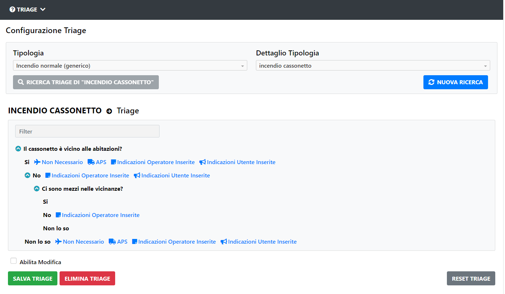

# Ricerca Triage

Per ricercare un Triage selezionare una Tipologia dalla lista, di seguito selezionare un Dettaglio Tipologia dalla lista, poi premere il pulsante di ricerca

A questo punto verrà visualizzato il Triage richiesto, se disponibile.

Se il Triage non è disponibile verrà mostrato un messaggio di errore e sarà possibile crearlo. (Vedi capitolo 6.2.2 "Creazione Triage" oppure capitolo 6.2.3 "Importazione Triage")

Per effettuare una nuova ricerca premere sul pulsante "Nuova Ricerca".

