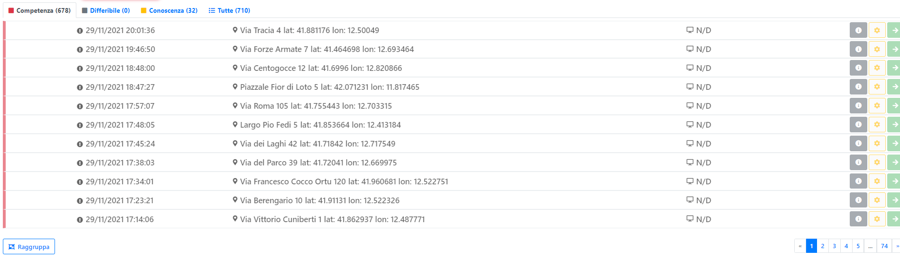

# Schede Contatto

Premendo sul tasto apposito sulla Home Page si accede alla sezione delle Schede Contatto.
In questa sezione sono raccolte tutte le schede contatto divise per: "Competenza", "Differibile", "Conoscenza"

Da questa sezione è possibile:
- Creare una nuova Chiamata premendo sul tasto verde con la freccia
- Impostare una scheda a "Gestita" premendo sul tasto giallo con l'ingranaggio
- Vedere il dettaglio della scheda contatto premendo sul tasto con la "i"

In basso a sinistra è presente il tasto "Raggruppa", con questo tasto è possibile raggruppare più schede contatto che fanno riferimento allo stesso intervento
> Le schede contatto verranno raggruppatte sotto la prima scheda selezionata