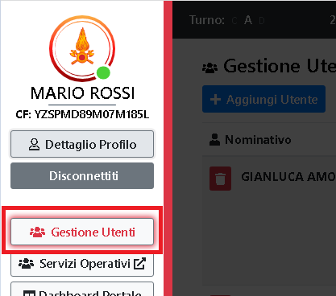

# Gestione Utenti

Gestione degli utenti dell'applicativo, e dei loro ruoli.

Per accedere alla pagina si passa dal menu laterale e si clicca sull'apposito tasto:

---

> ATTENZIONE
>
> Per accedere alla pagina e gestire gli utenti, è necessario il ruolo di amministratore.
