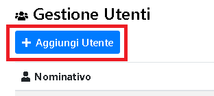
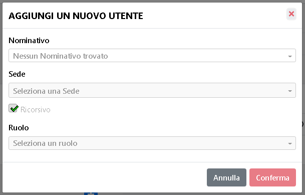
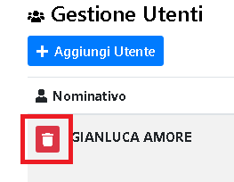
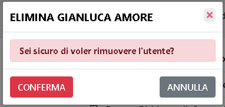
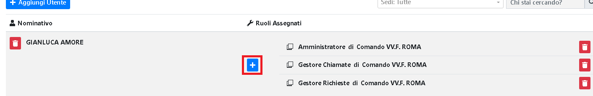
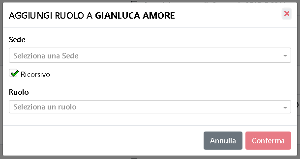
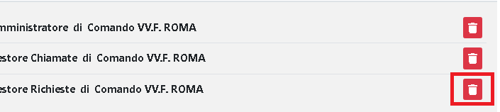
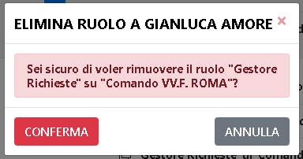

# Modifica Utente

## Nuovo Utente 

E' possibile creare un nuovo utente tramite l'apposito tasto.

Si aprirà in seguito il pannello con i dati da inserire del nuovo utente.

Tra i dati da inserire, vanno specificati il nominativo, la sede a cui l'utente fa riferimento, il fatto se sia ricorsivo* o meno, e il ruolo che ha per la sede specificata

>
> Il flag 'Ricorsivo', significa che l'utente assume il ruolo selezionato anche sui comandi o distaccamenti che fanno riferimento alla sede principale selezionata. 
(e.g. se assegno la sede Comando di Roma all'utente, e spunto il flag Ricorsivo, in automatico l'utente avrà lo stesso ruolo anche sui distaccamenti figli come Ladispoli o Anzio)
>

---

## Elimina Utente

E' possibile eliminare un utente esistente tramite l'apposito tasto.

Ed in seguito confermare la scelta.

---

## Aggiunta di un ruolo

E' possibile aggiungere un ruolo ad un utente esistente tramite l'apposito tasto.

Ed in seguito specificare gli stessi campi presenti anche in fase di "Nuovo Utente"

--- 

## Cancellazione di un ruolo

E' possibile eliminare un ruolo ad un utente esistente tramite l'apposito tasto.

Ed in seguito confermare la scelta.

